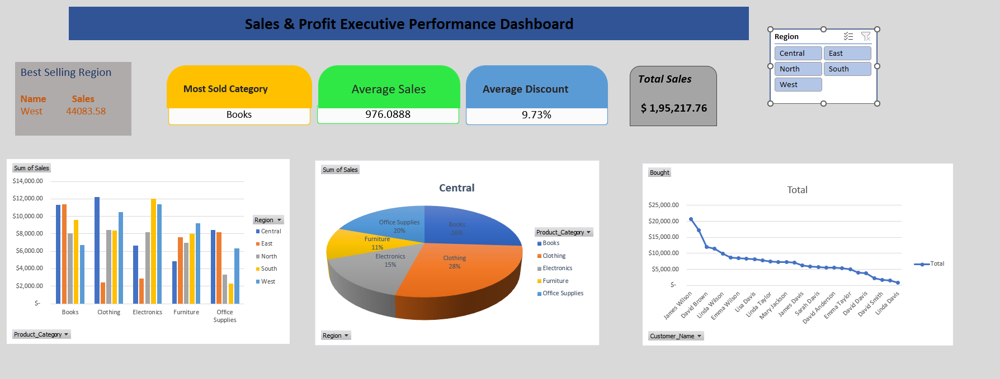
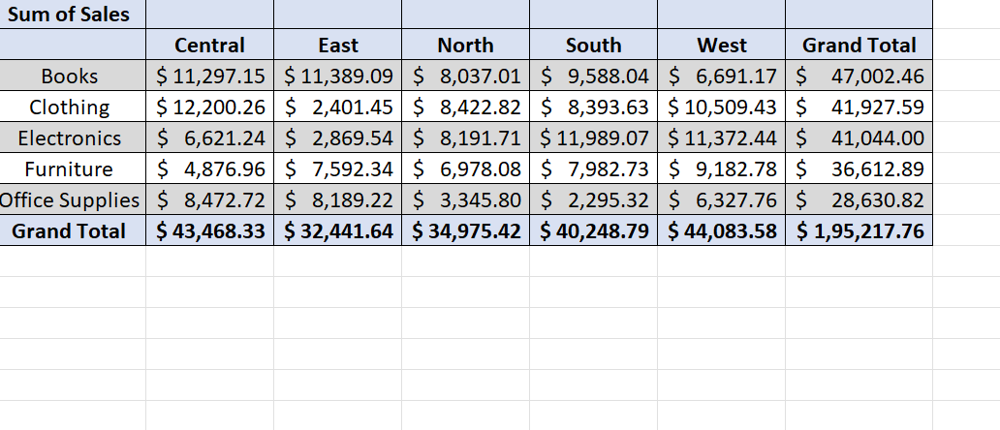
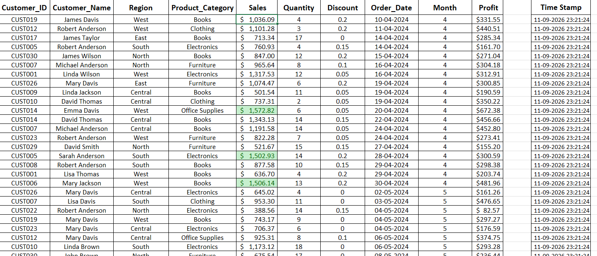
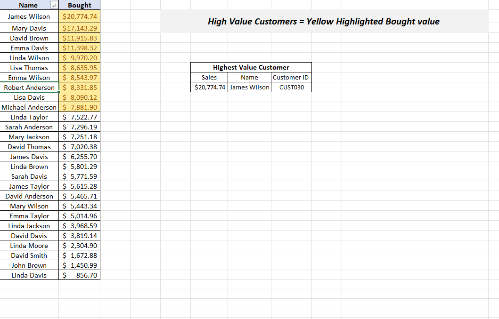
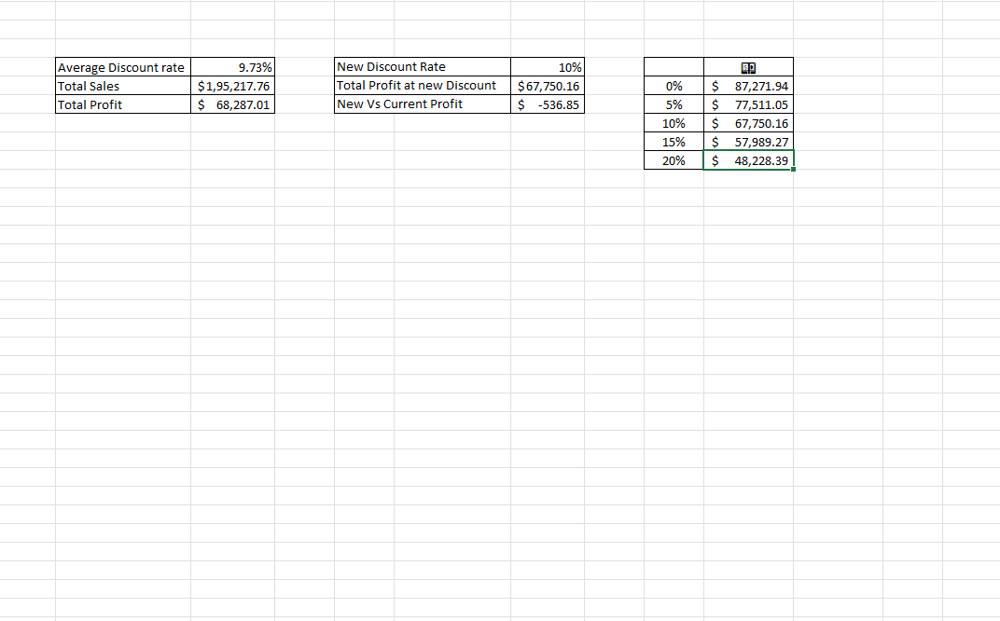
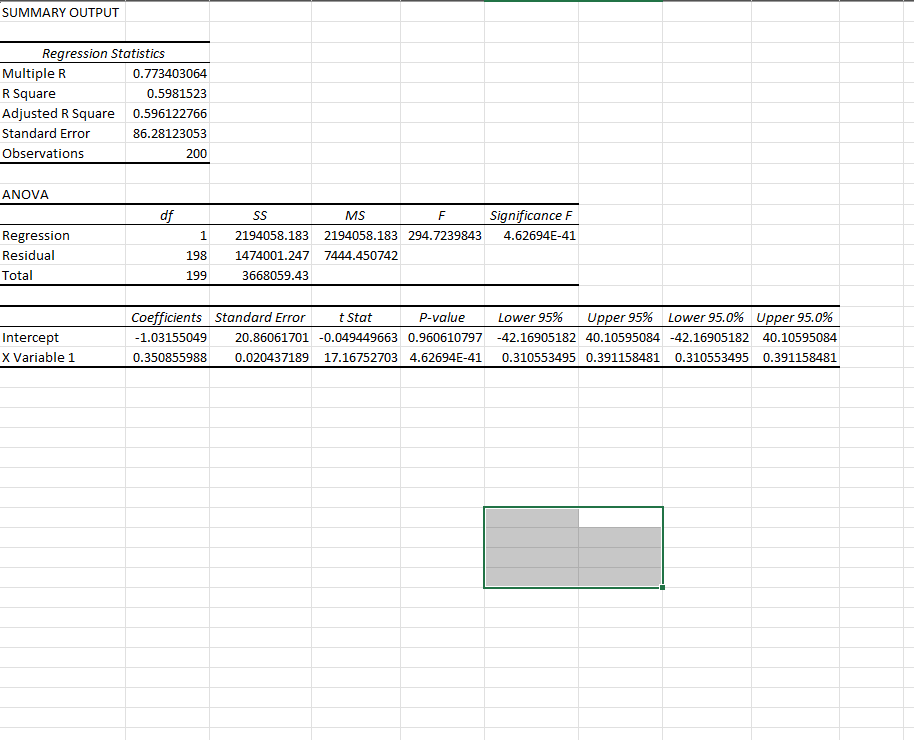

# -- ! Sales & Profit Executive Performance Dashboard ! --
### *Interactive Excel Analytics, High-Value Customer Profiling & Data-Driven Scenario Modeling*

 

> *"Data isn't just numbers on a grid — structure it well, and it drives strategy."*

---

## 📋 Table of Contents

- [-- ! Sales \& Profit Executive Performance Dashboard ! --](#----sales--profit-executive-performance-dashboard----)
    - [*Interactive Excel Analytics, High-Value Customer Profiling \& Data-Driven Scenario Modeling*](#interactive-excel-analytics-high-value-customer-profiling--data-driven-scenario-modeling)
  - [📋 Table of Contents](#-table-of-contents)
  - [📌 Overview](#-overview)
  - [🎯 Problem Statement](#-problem-statement)
  - [✨ Key Features](#-key-features)
  - [🏗️ Project Structure](#️-project-structure)
  - [🔺 Part A — Executive Dashboard \& Pivot Visuals](#-part-a--executive-dashboard--pivot-visuals)
    - [📝 1. Dashboard Architecture](#-1-dashboard-architecture)
    - [🗺️ 2. Core Dashboard KPI Summary](#️-2-core-dashboard-kpi-summary)
    - [📊 3. Category Sales Distribution Pivot](#-3-category-sales-distribution-pivot)
  - [🔢 Part B — Sales Data \& High-Value Customer Analytics](#-part-b--sales-data--high-value-customer-analytics)
    - [🔍 4. Transaction Master Log](#-4-transaction-master-log)
    - [👑 5. High-Value Customer Analysis](#-5-high-value-customer-analysis)
    - [🧮 6. What-If Analysis \& Statistical Output](#-6-what-if-analysis--statistical-output)
  - [🛠️ Tech Stack](#️-tech-stack)
  - [📈 Results \& Insights](#-results--insights)
  - [🏆 Advantages](#-advantages)
  - [📄 License](#-license)
  - [👤 Author](#-author)
    - [Neev Shankar](#neev-shankar)
  - [🙏 Acknowledgements](#-acknowledgements)

---

## 📌 Overview

The **Sales & Profit Executive Performance Dashboard** is a comprehensive Microsoft Excel analytical workbook built to provide executive-level visibility into regional performance, product sales distribution, customer profitability, and discount sensitivity.

This project is designed to:
- Aggregate granular order-level data into high-level dynamic KPI metrics
- Deliver multi-dimensional pivot summaries and region-based interactive slicing
- Identify top revenue-generating customers through conditional highlighting
- Perform statistical regression analysis and What-If scenario modeling for profitability optimizations

---

## 🎯 Problem Statement

> **Objective:** Build an interactive executive dashboard in Microsoft Excel to monitor total sales, analyze regional discount impacts, highlight top customer segments, and model profit margin sensitivities.

Modern retail and enterprise sales organizations generate high volumes of transactional records across multiple regional sectors. Without intuitive visual tools and aggregated modeling, identifying key growth drivers, low-margin products, and valuable customer relationships becomes challenging.

| 📂 Feature | 📄 Type | 🔍 Description |
|------------|---------|----------------|
| Executive Dashboard | Visual Interface | Dynamic KPIs, interactive slicers, and multi-chart layout |
| Regional Pivot Analysis | Data Summarization | Breaks down total sales by product categories across 5 regions |
| High-Value Customer Tracker | Customer Profiling | Ranks top customers by sales volume with conditional highlights |
| What-If & Scenario Modeling | Sensitivity Analysis | Evaluates profit fluctuations under varying discount rates |
| Linear Regression Analysis | Statistical Output | Evaluates relationship between order metrics and sales outcomes |

---

## ✨ Key Features

| Feature | Description |
|--------|-------------|
| 📊 **Interactive Regional Slicers** | Filter entire dynamic visual layouts by Central, East, North, South, and West regions |
| 🏷️ **Dynamic KPI Cards** | Real-time calculation of Best Selling Region, Most Sold Category, Average Sales, and Total Revenue |
| 👥 **High-Value Customer Identification** | Automatically highlights premium buyers based on spending thresholds |
| 🔀 **What-If Data Sensitivity Tables** | Analyzes profit shifts under 0%, 5%, 10%, 15%, and 20% discount scenarios |
| 📈 **Statistical Regression Modeling** | Displays Summary Output including R Square ($0.598$), ANOVA, and p-values |
| 🍩 **Category Sales Distribution Chart** | Visualizes relative product contributions across regional sectors |
| 📉 **Customer Spending Line Charts** | Illustrates long-tail customer acquisition and purchasing trends |

---

## 🏗️ Project Structure

---

## 🔺 Part A — Executive Dashboard & Pivot Visuals

### 📝 1. Dashboard Architecture

The main executive dashboard consolidates key financial metrics into clean, top-level KPI summary cards alongside multi-perspective interactive charts.

---

### 🗺️ 2. Core Dashboard KPI Summary

| KPI Metric | Value | Insights |
|------------|-------|----------|
| 🏆 **Best Selling Region** | **West** ($44,083.58) | Highest total regional contribution |
| 📦 **Most Sold Category** | **Books** | Leading category by total transaction volume |
| 💵 **Average Sales** | **$976.09** | Mean sales transaction value |
| 🏷️ **Average Discount** | **9.73%** | Portfolio-wide average promotional discount |
| 💰 **Total Revenue** | **$1,95,217.76** | Aggregate revenue generated across all sectors |

---

### 📊 3. Category Sales Distribution Pivot

> Aggregates category performance by region to evaluate balance across revenue streams.

**Pivot Breakdown:**

---

## 🔢 Part B — Sales Data & High-Value Customer Analytics

### 🔍 4. Transaction Master Log

> Raw granular order records capturing Customer IDs, product choices, regional destinations, unit quantities, and discount structure.

---

### 👑 5. High-Value Customer Analysis

> Highlights top revenue contributors to enable targeted customer retention strategies.

**Key Customer Highlights:**
- **Highest Value Customer:** James Wilson (`CUST030`) with **$20,774.74** total sales.
- **Top Tier (Yellow Highlighted):** Includes Mary Davis ($17,143.29), David Brown ($11,915.83), Emma Davis ($11,398.32), Linda Wilson ($9,970.20), and Lisa Thomas ($8,635.95).

---

### 🧮 6. What-If Analysis & Statistical Output

> Sensitivity tables and statistical regression outputs evaluating discount strategies and profit elasticity.

**What-If Sensitivity Table:**

| Discount Scenario Rate | Expected Total Profit | Delta vs Current Profit |
|------------------------|-----------------------|-------------------------|
| **0%**                 | $87,271.94            | +$18,984.93             |
| **5%**                 | $77,511.05            | +$9,224.04              |
| **10%**                | $67,750.16            | -$536.85                |
| **15%**                | $57,989.27            | -$10,297.74             |
| **20%**                | $48,228.39            | -$20,058.62             |

**Regression Statistics Summary:**

- **Multiple R:** $0.7734$
- **R Square:** $0.5982$
- **Adjusted R Square:** $0.5961$
- **Observations:** $200$

---

## 🛠️ Tech Stack

| Tool | Focus Area | Purpose |
|------|------------|---------|
| 📊 **Microsoft Excel** | Core Engine | Data aggregation, formulas, dynamic tables |
| 🔄 **Pivot Tables & Charts** | Summarization | Categorical and regional slicing |
| 🎛️ **Slicers & Controls** | User Interface | Interactive dashboard filtering |
| 🧪 **Data Analysis ToolPak** | Statistics | Linear regression modeling and ANOVA |
| 💡 **What-If Analysis** | Scenario Modeling | Data tables for promotional sensitivity |

---

## 📈 Results & Insights

The analytical models yield actionable sales management takeaways:

- 🟢 **Top Regional Contributor:** The **West Region** ($44,083.58) closely followed by **Central** ($43,468.33).
- 📦 **Category Leaders:** **Books** ($47,002.46) and **Clothing** ($41,927.59) represent the primary revenue drivers.
- 🎯 **Discount Sensitivity:** Moving average discount beyond **9.73%** sharply erodes margin without proportional volume gains.
- 👥 **Pareto Distribution:** A small segment of high-value buyers accounts for a disproportionate share of gross revenue.

---

## 🏆 Advantages

| Advantage | Detail |
|-----------|--------|
| 💼 **Executive Ready** | Polished layout suitable for stakeholder presentations |
| ⚡ **Dynamic Slicing** | Real-time regional visual filtering via native slicers |
| 📊 **Advanced Analytics** | Built-in statistical regression and scenario modeling |
| 🔍 **Zero Code Required** | Built natively in Excel for seamless organizational adoption |

---

## 📄 License

This project is licensed under the **MIT License** — see the [LICENSE](LICENSE) file for full details.

---

## 👤 Author

### Neev Shankar

> *"Data transformed into structure becomes insight; insight transformed into strategy becomes growth."*

**🎓 Role:** Data Analyst & Excel Specialist \
**📍 Location:** India\
**🛠️ Skills:** Microsoft Excel · Analytics · Pivot Tables · Executive Dashboards · Data Modeling

---

## 🙏 Acknowledgements

Special thanks to the open-source communities and resource centers:

- 📚 [Microsoft Excel Documentation](https://support.microsoft.com/en-us/excel) — Spreadsheet functions & Pivot guides
- 📊 [Exceljet](https://exceljet.net/) — Formula references and dashboard tips
- 🎓 [Chandoo.org](https://chandoo.org/) — Dashboard design guidelines & techniques

---

---

*Made with ❤️ and ☕ — Last updated: 11 September, 2026*

